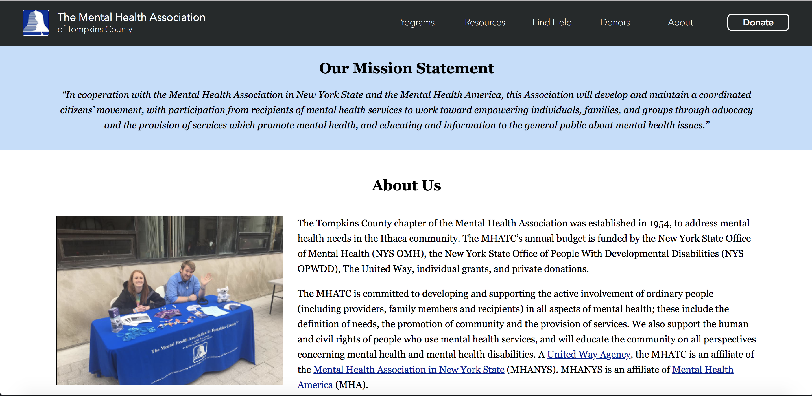
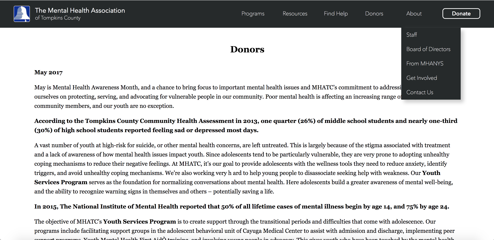
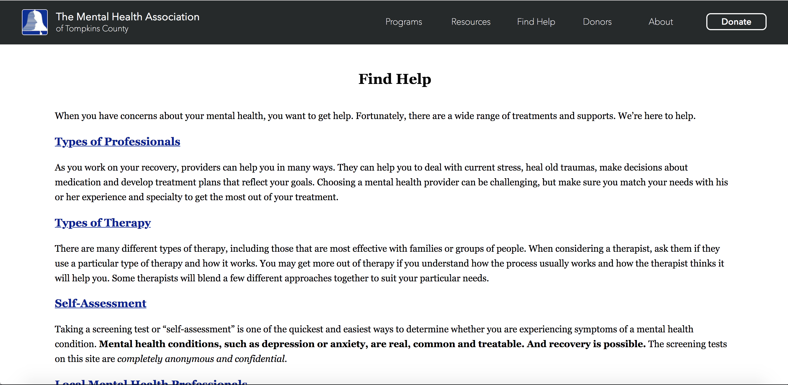
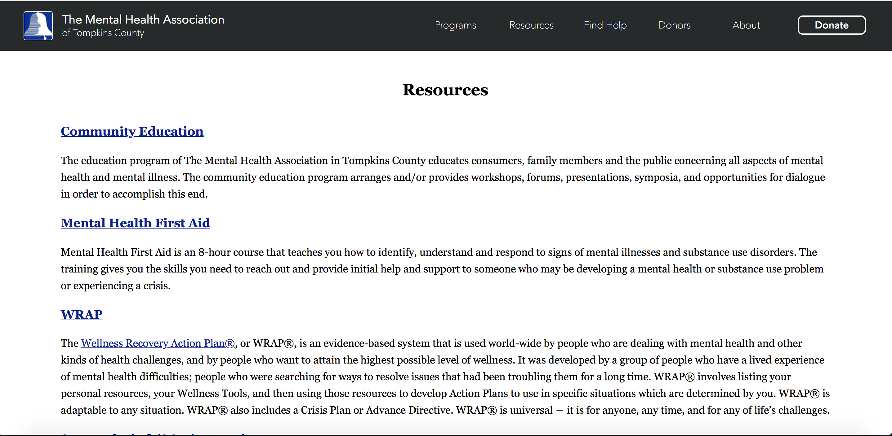

### README ###
Want to know more information about the Mental Health Association of Tompkin's county?
Check out their (unofficial) site! As part of this course's final project, a team of
three people were to find a client and create a website for them. My team wanted
to make a difference in the local community and reached out to the Mental
Health Association of Tompkin's County to redesign their site to make it more
accessible, modern, and responsive. We are in the midst of launching the site.

Here are some snapshots of the site!








To fully interact with the site, clone this repository. If you have atom, right click on the index.php page and scroll down until you see the PHP: Start Server option. Click it. If you don't have atom, you can start the php server on your terminal.

```
cd path/to/your/app
php -S localhost:8000
```

If localhost:8000 is currently being used, try localhost:8001.
