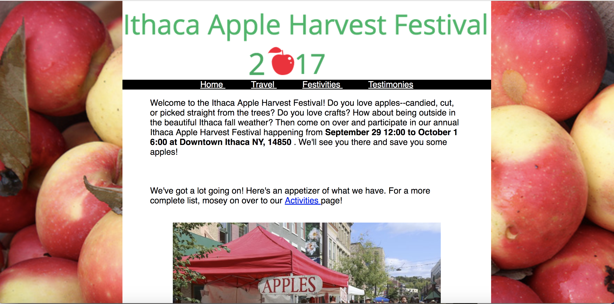
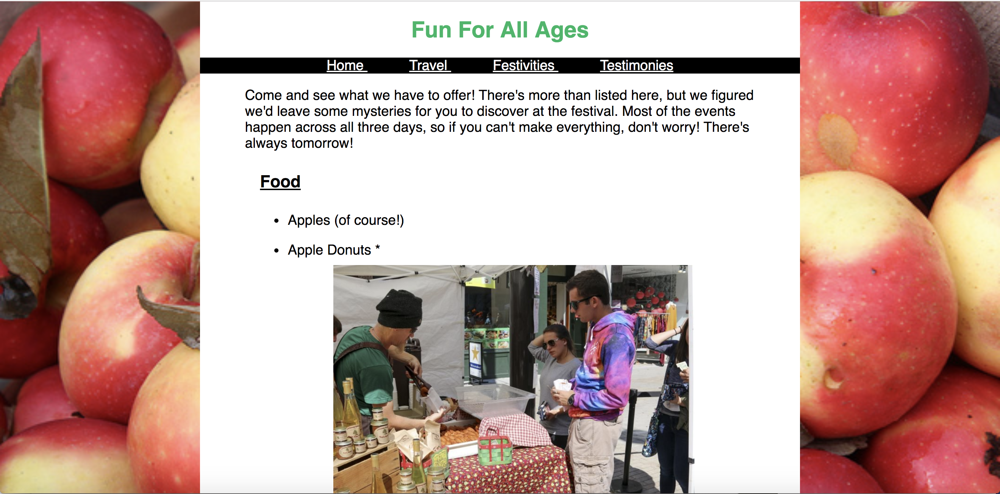

### README ###
Learn more about the annual Ithaca Apple Harvest Festival through this (unofficial) website! 
This website provides the performance schedules, parking and lodging information, and the 
various goodies you can chow down on! The website is responsive, so whether you're looking 
on your computer or on your phone, you'll be able to quickly and easily find the information 
you're looking for!

Here are some snapshots from the site!





To fully interact with the site, clone this repository! Then you can start the php server through your terminal:

```
cd path/to/your/app
php -S localhost:8000
```

If localhost:8000 is currently in use, use localhost:8001
